## 🖼️ 디자인 화면 

  
🖼️ 스플래시 화면 보기

   
  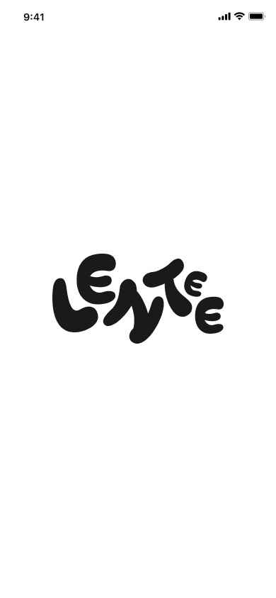

  
🖼️ 서비스 시작 화면 

   
  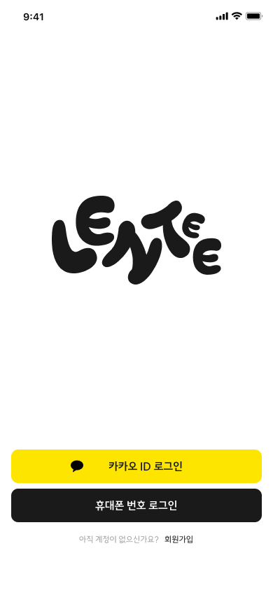

  
🖼️ 로그인 화면 

   
  
  
  
  

  
🖼️ 회원가입 화면 

   
   [ 본인인증 ] 

   
  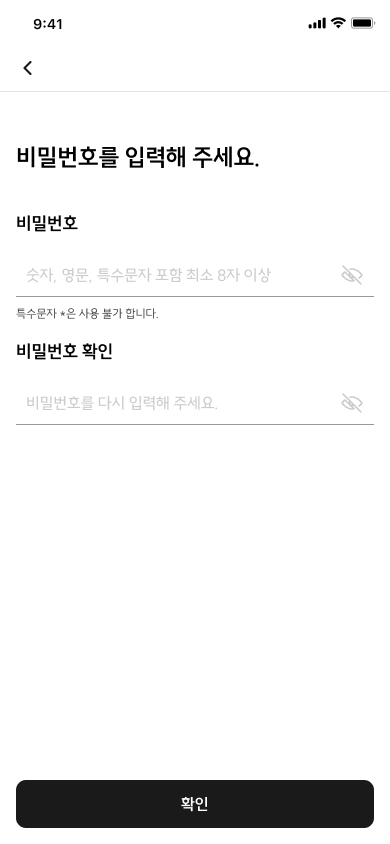
  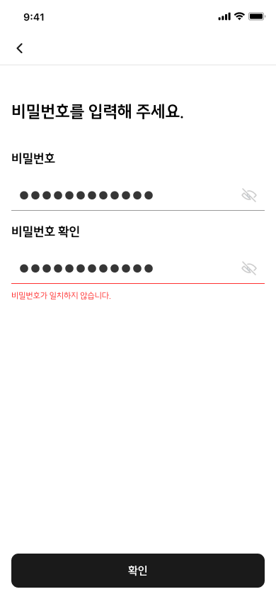
  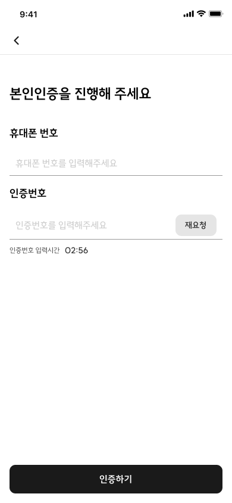
  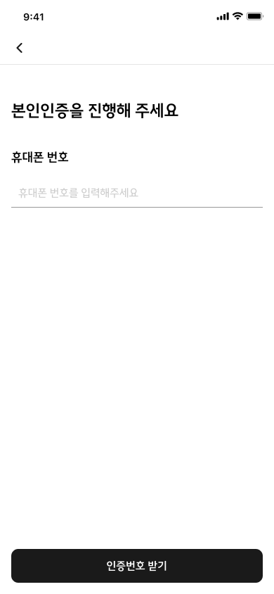
  
   
   [ 서비스 환영 ] 

   
  

   
   [ 약관 동의 ] 
   
  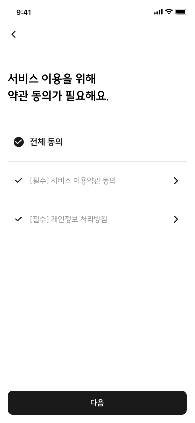
  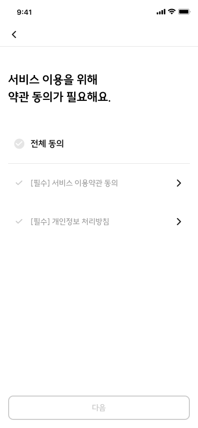

   
   [ 프로필 등록 ]

   
  
  

  
🖼️ 비밀번호 재설정 화면 

   
  
  
  
  
  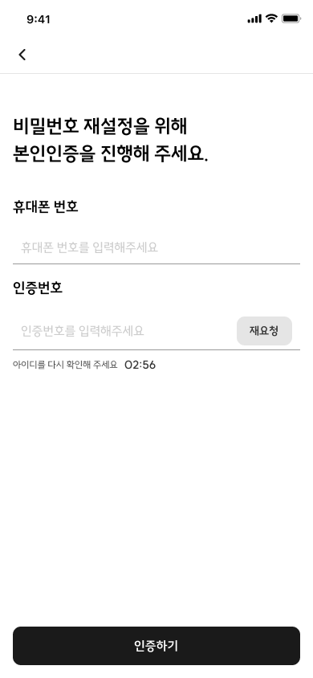
  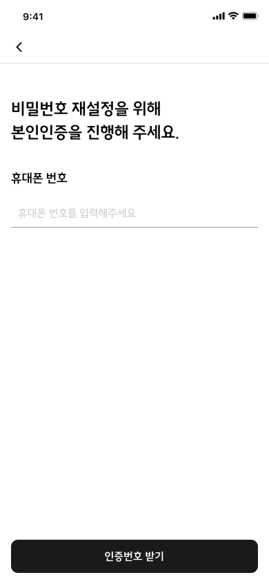
  
  
  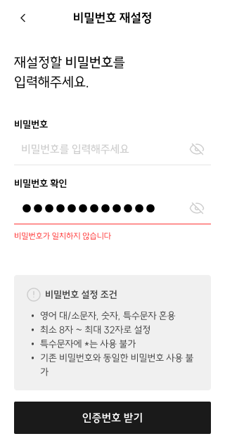
  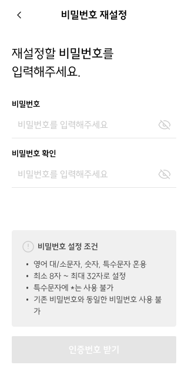
  
  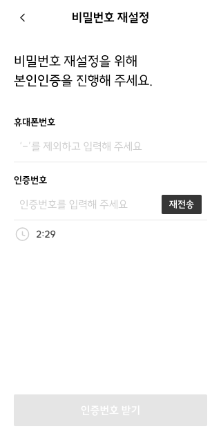
  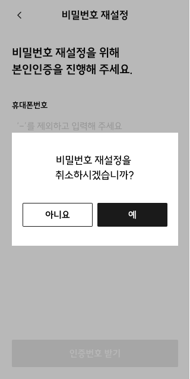
  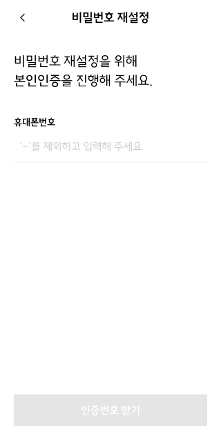

  
🖼️ 메인 화면 

   
  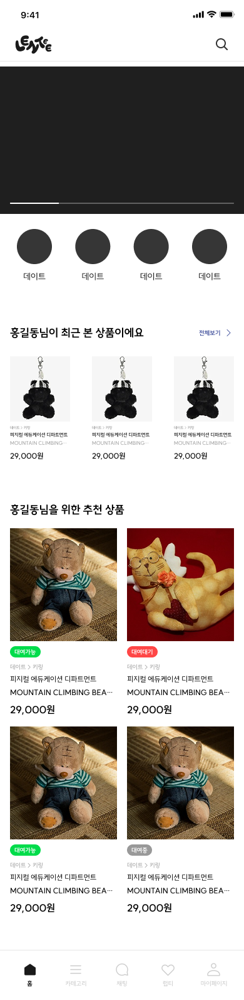

  
🖼️ 게시글 상세 화면

   
  
  
  
  
  
  
  
  
  
  
  
  

  
🖼️ 게시글등록 화면

   
  
  

